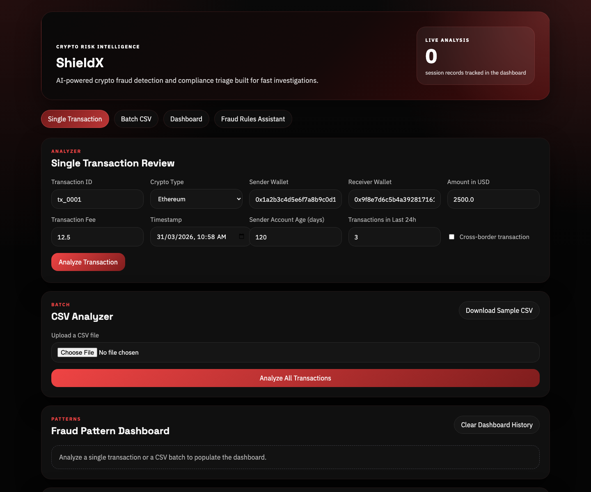
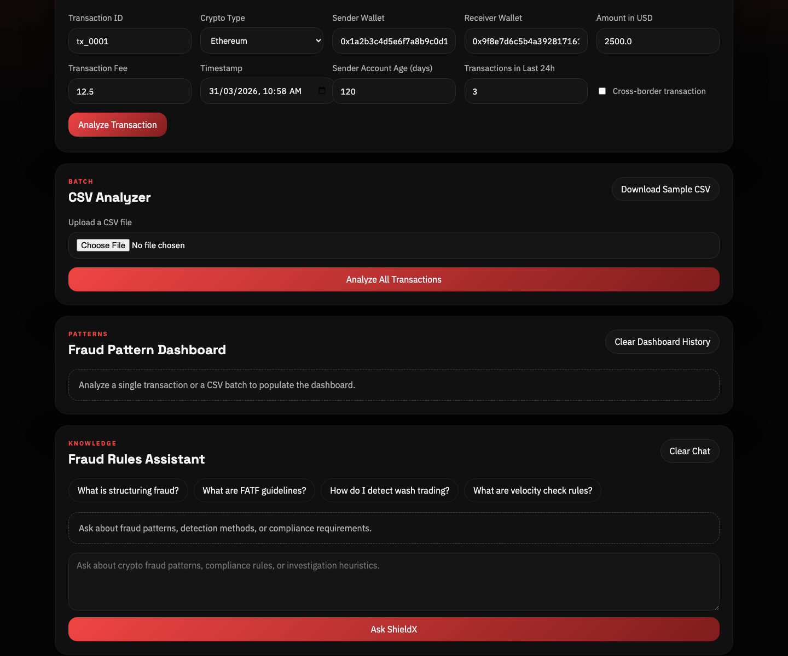

# ShieldX

ShieldX is a crypto fraud detection and compliance review app for single transactions, batch CSV uploads, fraud pattern dashboards, and fraud-rules Q&A powered by Groq.

## Live Deployment

- App: https://shieldx-ten.vercel.app

## Screenshots

### Home

### Dashboard

### Fraud Rules Assistant

## Features

- Single transaction fraud analysis with fraud score, risk level, indicators, and recommendation
- Batch CSV transaction analysis with downloadable sample input
- Fraud pattern dashboard with risk, score, and recommendation charts
- Fraud rules assistant for compliance and detection workflows

## Tech Stack

- Flask
- Groq
- Pandas
- Plotly
- Vercel

## Theme

- Black-and-red UI with a darker dashboard visual system
- Responsive single-page experience for desktop and mobile

## Local Setup

1. Create a virtual environment and activate it.
2. Install dependencies with `pip install -r requirements.txt`.
3. Add `GROQ_API_KEY` to a root `.env` file.
4. Run the app with `flask --app app run`.
